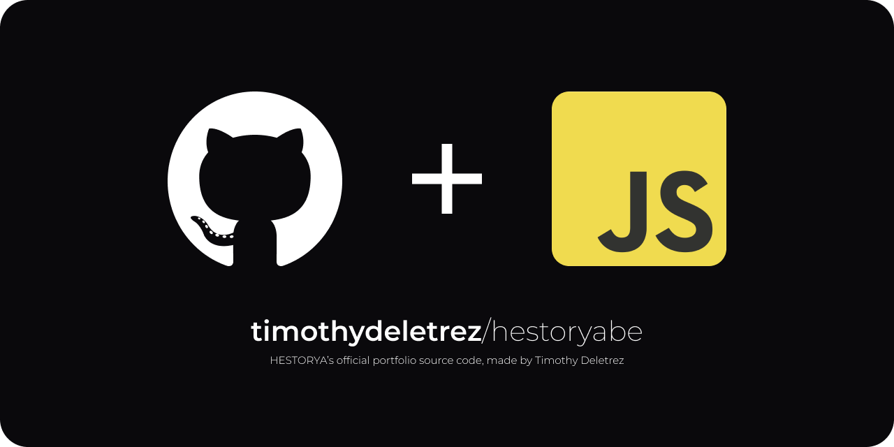

  

  
  
  

This is the source code of the portfolio of HESTORYA.

Currently the website URL is [hestorya.be](https://hestorya.be)

## Color Reference

| Color             | Hex                                                                |
| ----------------- | ------------------------------------------------------------------ |
| Landing Section Gradient 1 |  #66838F |
| Landing Section Gradient 2 |  #485F6C |
| Landing Section Gradient 3 |  #20313F |
| Landing Section Gradient 4 |  #061220 |
| AboutMe Section Background |  #030A12 |

## Acknowledgements

 - [SimpleCodingTutorials](https://github.com/SimpleCodingTutorials) for the chess game

## Authors

- [@timothydeletrez](https://github.com/timothydeletrez)

